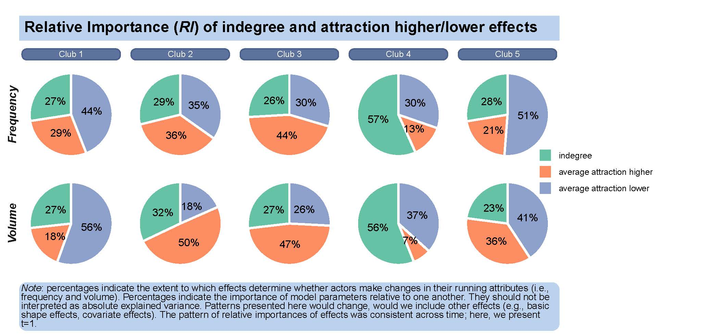

```{r, globalsettings, echo=FALSE, warning=FALSE, message=FALSE, results='hide'}
Sys.setenv(LANG = "en")

library(knitr)
library(RSiena)
library(RColorBrewer)
library(ggplot2)
library(ggtext)

knitr::opts_chunk$set(echo = TRUE)
opts_chunk$set(tidy.opts=list(width.cutoff=100),tidy=TRUE, warning = FALSE, message = FALSE,comment = "#>", cache=TRUE, class.source=c("test"), class.output=c("test2"))
options(width = 100)
rgl::setupKnitr()

colorize <- function(x, color) {sprintf("<span style='color: %s;'>%s</span>", color, x) }

```

```{r klippy, echo=FALSE, include=TRUE}
klippy::klippy(position = c('top', 'right'))
#klippy::klippy(color = 'darkred')
#klippy::klippy(tooltip_message = 'Click to copy', tooltip_success = 'Done')
```


----

# Relative importance

Here, we calculate the expected relative importance of our selection effects [for more information, see Indlekofer and Brandes, -@indlekofer2013]. We present only a perspective of RI (a) aggregated over all actors and (b) at time-point 1. 


```{r eval=F}
rm(list=ls())

# We use a function to load the objects under new names.
loadRData <- function(fileName){
  #loads an RData file, and returns it
  load(fileName)
  get(ls()[ls() != "fileName"])
}

# get the RSiena object lists for both models (frequency and volume)
mydata_freq <- loadRData("clubdata_rsiena_freq.RData")
mydata_vol <- loadRData("clubdata_rsiena_vol.RData")

# we make a list, in which we store RI-objects for each club
RI_list <- list()

for (i in 1:5) { # for each club

  #get sienaFit list 
 
  ansL <- loadRData(paste0("test/sienaFit/sienaFit_club", i, ".RData"))

  #take model 5 (avAttH, avAttL, indegree...)
  ans <- ansL[[5]]
  
  # get only parameters for the evaluation function
  theta.eval <- ans$theta[ans$effects$type[ans$effects$include]=="eval"]
  myeff.eval <- ans$effects[ans$effects$type[ans$effects$include]=="eval",]
  
  # only effects we are interested in
  # here, selection based on on ego, alter and dyad features.
  myeff.eval <- myeff.eval[c(9:15), ] 
  # note: also include outdegree (or another effect pertaining to network dynamics); apparently this is needed...
  # first, I excluded the shape effects, as they heavily compound the resulting plots (they are most important...)
  theta.eval <- theta.eval[c(9:15)] 
  
  # algorithm used
  myalgo <- sienaAlgorithmCreate(projname = "test", nsub=5, n3=5000 )
  
  # use sienaRI()
  RI <- sienaRI(
    data = mydata_freq[[i]],
    theta = theta.eval,
    algorithm = myalgo,
    effects = myeff.eval
  )
  
  # extract RI for the behavior dynamics
  #RI_beh <- RI[[2]]
  
  # take the statistics for time t
  t = 1
  RI_freq <- RI$expectedRI[[t]]
  
  # and repeat the same procedure for volume
  ansL <- loadRData(paste0("test/sienaFit/duration/sienaFit_club", i, ".RData"))
  ans <- ansL[[5]]
  theta.eval <- ans$theta[ans$effects$type[ans$effects$include]=="eval"]
  myeff.eval <- ans$effects[ans$effects$type[ans$effects$include]=="eval",]
  myeff.eval <- myeff.eval[c(9:15), ]
  theta.eval <- theta.eval[c(9:15)]
  RI <- sienaRI(
    data = mydata_vol[[i]],
    theta = theta.eval,
    algorithm = myalgo,
    effects = myeff.eval
  )
  
  RI_vol <- RI$expectedRI[[t]]
  
  # combine 
  RIc <- c(RI_freq, RI_vol)
  
  # put in the list
  RI_list[[i]] <- RIc
}

# we make a dataframe for plotting multiple pie charts
df_plot <- data.frame(
  ri = unlist(RI_list),
  eff = substring(RI$effectNames, 6),
  y = rep(c("Frequency", "Volume"), 7, each=5),
  club = rep(c("Club 1", "Club 2", "Club 3", "Club 4", "Club 5"), 1, each = 7)

)


# alter effect names
df_plot$eff <- as.factor(df_plot$eff)
levels(df_plot$eff)[3] <- "higher activity"
levels(df_plot$eff)[5] <- "activity alter"
levels(df_plot$eff)[6] <- "activity ego"
levels(df_plot$eff)[7] <- "activity similarity"


# reorder effect for plot
#df_plot$eff <- factor(df_plot$eff,
#                     levels = c("indegree", "average attraction higher", "average attraction lower", "gender", "other activities"))
#....

# nice colors
color <- brewer.pal(7, "Set2")

ggplot(df_plot, aes(x="", y=ri, fill=eff)) +
  geom_bar(width = 1, size = 1, color = "white", stat = "identity") +
  coord_polar("y") +
  geom_text(aes(label = paste0(round(100*ri), "%")), 
            position = position_stack(vjust = 0.5)) +
  labs(x = NULL, y = NULL, fill = "Effects", 
       title = "<b><span style = 'font-size:16pt'>Relative Importance (<i>RI</i>) of selection effects based on actor attributes</span>",
       caption = "<span style = 'font-size:10pt'><i>Note</i>: percentages indicate the extent to which effects determine whether actors make changes in their kudos ties.
       Percentages indicate the importance of model parameters relative to one another. They should not be interpreted as absolute explained variance. Patterns presented here would change, would we include other effects. 
       The pattern of relative importances of effects was consistent across time; here, we present t=1.") +
  guides(fill = guide_legend()) +
  scale_fill_manual(values = color) +
  facet_grid(y~club, switch = "y") +
  theme_classic() +
    theme(axis.line = element_blank(),
      axis.text = element_blank(),
      axis.ticks = element_blank(),
      legend.title = element_blank(),
      
      plot.title = element_textbox_simple(
        padding = margin(5.5, 5.5, 5.5, 5.5),
        margin = margin(0, 0, 5.5, 0),
        fill = "lightsteelblue2",
        lineheight=1),
      
      strip.text.x = element_textbox(
        size = 9,
        color = "white", fill = "#5D729D", box.color = "#4A618C",
        halign = 0.5, linetype = 1, r = unit(5, "pt"), width = unit(1, "npc"),
        padding = margin(2, 0, 1, 0), margin = margin(3, 3, 3, 3)
      ),
      
      strip.text.y = element_textbox_simple(
        size=12,
        face="bold.italic",
        vjust=1),
      
      strip.background = element_blank(),
      
      plot.caption = element_textbox_simple(
        padding = margin(2, 2, 2, 2),
        margin = margin(0, 0, 2, 0),
        fill = "lightsteelblue2",
        lineheight=1,
        vjust=1.5,
        r = grid::unit(8, "pt")))
```



----


### References 
