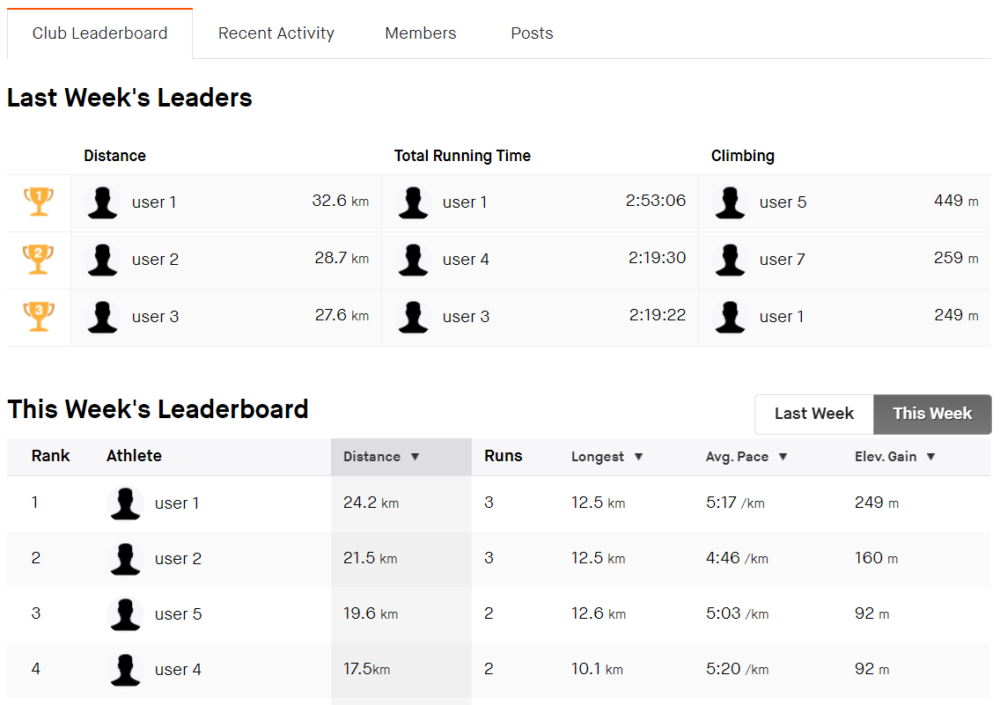
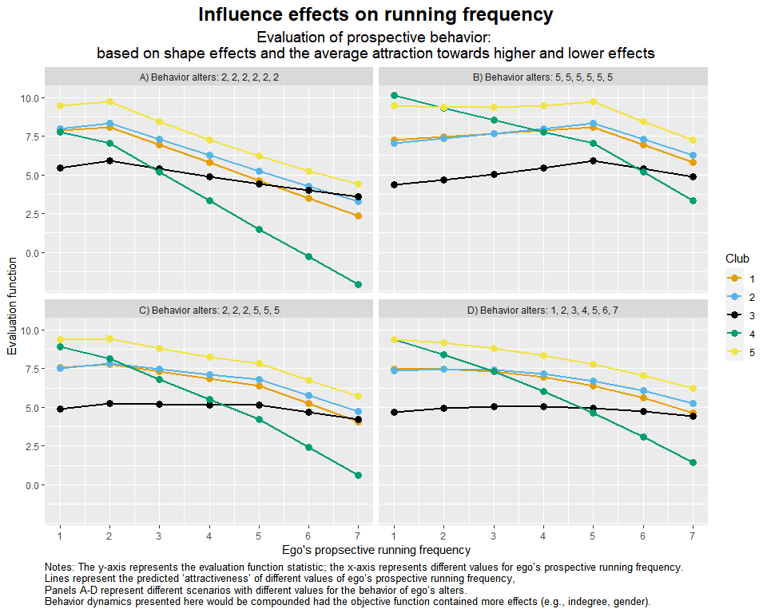

```{r, globalsettings, echo=FALSE, warning=FALSE, message=FALSE}
library(knitr)
library(kableExtra)
library(dplyr)

knitr::opts_chunk$set(echo = TRUE)
opts_chunk$set(tidy.opts=list(width.cutoff=100),tidy=TRUE, warning = FALSE, message = FALSE,comment = "#>", cache=TRUE, class.source=c("test"), class.output=c("test2"))
options(width = 100)
rgl::setupKnitr()


colorize <- function(x, color) {sprintf("<span style='color: %s;'>%s</span>", color, x) }

```

```{r klippy, echo=FALSE, include=TRUE}
klippy::klippy(position = c('top', 'right'))
#klippy::klippy(color = 'darkred')
#klippy::klippy(tooltip_message = 'Click to copy', tooltip_success = 'Done')
```

----


<br>

<br>


<p style="font-size:32pt; font-style:italic">
    Social network influence on sport behavior:
</p>

<p style="font-size:32pt; font-style:italic">
    an actor-based approach using Strava
</p>

<br>

Rob Franken (rob.franken@ru.nl) 

PhD student at Sociology department, Radboud University Nijmegen / ICS

Supervision by Jochem Tolsma and Hidde Bekhuis

<br>


<br>

<br>

<br>

----

<br>

<br>

<br>

<br>

# Background 

* Social networks are known to influence various aspects of health! 

* Currently, the question of (how) social networks affect **sport participation** remains rather unexplored:

  + Prior studies mostly operationalized social networks as individual-level measures of no. of ties and attributes of these ties (e.g., perceived support).

  + Prior SAOM studies on sports and physical activity (PA) focussed on **friendship networks among children in school classes** [e.g., De la Haye et al., -@delahaye2011; Fujimoto et al., -@fujimoto2018; Simpkins et al., -@simpkins2013; Shoham et al., -@shoham2012].
  
  + Current (SAOM) studies on the networks-PA link used **self-report measures** of sport/physical activity.
  
<br>

# Social media

* Alongside the emergence of traditional social media platforms (e.g., Facebook), **online fitness community platforms** (OFCs, e.g., Strava ) rose to prominence.

* Increasing levels of public participation in OFCs has created a new population of subjects ...

  + ... whose real social (online) interactions are recorded
  
  + ...  whose health behaviors are accurately tracked (through self-tracking with GPS-enabled devices).
  
  

* OFCs as novel tools for investigating social dynamics in sports!
  


<br>

# Strava

* Web-based platform/mobile app used by recreational/professional athletes (mainly in running and cycling).

* Strava maps the route, logs the pace, and uploads activity posts onto the app (generally, automatically) with subsequent analysis. 

* Strava uses a 'following'-system. Activity posts appear on personal feeds (log) and in followers' feed.

* Friends can interact by giving *kudos* (virtual thumbs-up) and (short) written comments.


<br>

<br>

<br>

<br>

# Data from CLUBS

We focus on Strava *clubs* (N=5): accessible communities (like FB-groups) which enable individuals to form connections, join up and workout together, interact with one another, and compete on the leaderboard.



We focus on virtual extension of (official) Dutch running clubs ...

* diverse with respect to size (largest: n=165; smallest: n=13), geographical location, organizational setting, and audience (e.g., amateurs, elites, seniors):

  + ruling out unmeasured confounders at the club-level;
  
  + circumventing the potential risk of oversampling of highly active users.
  

A focus on clubs ...

* raises the potential concern that we underestimate *mechanisms*...

* but not *effects*: clubs represent **complete networks**, thus ensuring that we can model selection and influence adequately.

  
* We use data on the **kudos network** (who gives kudos to whom?) and on **sport activity attributes** over 12 waves.

* Given the high sensitivity of our data, we aggregated data for each user to a one month period:

  + Frequency with which running activities were posted to the Strava club as a proxy for the number of running sessions per month. *Running frequency* was converted to times per week (0-7+). 
  
  + We aggregated the total volume of running activities per month. We converted *running volume* to hours per week (0-7+).
    


<br>

<br>

<br>

<br>

# Kudos network

* Kudos: lightweight one-click feedback action serving as a social cue of affect, support or admiration/aspiration.

* Kudos: event data or social states?

  + In the case of our clubs (i.e., virtual extension of offline clubs), we expect concordance between offline (unobserved) relationships  and kudos ties.
  
  + Kudos as online proxies of offline relationships.
  
  + Kudos ties are stable (see [descriptives](https://robfranken.github.io/Strava/destab.html#Table))!

* *1 or more* kudos sent/received required for a tie to exist ? ...

  + Higher cut-off value for no. of kudos required for a tie?
  
  + Multiple ordered networks?
  
  Brings great complexity: behavior (here, running frequency, proxied by no. of posts) limits potential no. of in-ties would we opt for a higher cut-off! 


----

<br>

<br>

<br>

<br>

<br>

<br>

<br>

<br>


# Theory & hypotheses

Two prominent theoretical arguments made in the literature [see Zhang et al., -@zhang2016] and used in programs/interventions: 

1. Network partners may provide various types of social support that promote sport participation (cf. Centola 2010).

2. The training habits of network partners may serve as goals to strive for (cf. Shakya et al. 2015). 

<br>

We test these mechanisms using SAOMs and our Strava data:

1. The receipt of kudos (no. of in-ties) affects change in sport behavior (*social support expectation*)

2. Sport activities of peers (whom ego gives kudos) influence ego's sport activity, which we operationalize as assimilation (*social comparison expectation*).

... while controlling for multiple factors that may affect whom to interact with and factors influencing sport activity (e.g., gender, seasonal effect, shared club contexts).

----

<br>

<br>

<br>

<br>

<br>

<br>


# Model selection 

## 1. Kudos tie formation dynamics {.tabset .tabset-fade} 

### Structural effects

* In all clubs: *Outdegree*, *reciprocity*, *transitivity (GWESP)*
* In some clubs: *out-isolate*, interaction *recip.* x *GWESP*.

### Degree-related effects

* In all clubs: *indegree-popularity* (sqrt.), *outdegree-activity* (sqrt.)
* In some clubs: *reciprocal degree-related activity*, *outdegree-popularity* (sqrt.)

### Selection effects
* In all clubs: *higher* effect (preferential attachment to alters compared to whom ego scores lower on the behavior, in the case of a negative sign)
* *Gender* (ego-, alter-, same-effects)

Friendships (constant dyadic covariate) was important for kudos tie formation, but it explained similar observed network structures as our included structural effects (e.g., reciprocity, transitivity).


## {-} 

<br>

## 2. Running activity dynamics {.tabset .tabset-fade} 

```{r functions, class.source = 'fold-hide'}
fcentering <- function(actors){
centered <- actors - mean(actors)
return(centered)
}

fsimij <- function(actors, min, max){
#rv <- max(actors) - min(actors)
rv <- max - min
mat1 <- matrix(actors, nrow=length(actors), ncol=length(actors), byrow=TRUE)
mat2 <- t(mat1)
simij <- 1 - ( abs(mat1-mat2) / rv)
return(simij)
}

flinear <- function(ego, alters, ...) {
  actors <- c(ego,alters) #define the network
  beh_centered <- fcentering(actors) #center behavior scores
  
  statistic <- beh_centered[1] #the actual statistic
  
  return(statistic)
}

fquad <- function(ego, alters, ...) {
  actors <- c(ego,alters) #define the network
  beh_centered <- fcentering(actors) #center behavior scores
  
  statistic <- (beh_centered[1])^2 #the actual statistic
  
  return(statistic)
}

favSim <- function(ego, alters, min, max) {
  actors <- c(ego,alters) #define the network
  beh_centered <- fcentering(actors) #center behavior scores
  simij <- fsimij(beh_centered, min, max) #calculate the similarity scores
  diag(simij) <- NA
  msimij <- mean(simij, na.rm=TRUE) #calculate the mean similarity score. only calculate mean on non-diagonal cells??!!
  simij_c <- simij - msimij #center the similarity scores
  
  statistic <- sum(simij_c[1,], na.rm = TRUE) / length(alters) #the actual statistic
  
  return(statistic)
}

favAttHigher <- function(ego, alters, min, max) {
  actors <- c(ego,alters)
  beh_centered <- fcentering(actors)
  simij <- fsimij(beh_centered, min, max)
  diag(simij) <- NA
  
  simijH <- simij[1,]
  simijH[beh_centered <= beh_centered[1]] <- 1
  simijH[1] <- NA
  statistic <- sum(simijH, na.rm = TRUE) / length(alters)
  
 
  return(statistic)
}


favAttLower <- function(ego, alters, min, max) {
  actors <- c(ego,alters)
  beh_centered <- fcentering(actors)
  simij <- fsimij(beh_centered, min, max)
  diag(simij) <- NA
  
  simijL <- simij[1,]
  simijL[beh_centered >= beh_centered[1]] <- 1
  simijL[1] <- NA
  statistic <- sum(simijL, na.rm = TRUE) / length(alters)
  
 
  return(statistic)
}

favAlt <- function(ego, alters, ...) {
  actors <- c(ego,alters)
  beh_centered <- fcentering(actors)
  
  statistic <- beh_centered[1] * (sum(beh_centered[-1], na.rm = TRUE) / length(alters))
  
 
  return(statistic)
}

fAttMean <- function(ego, alters, min, max, ...) {
  rv <- max - min
  actors <- c(ego,alters)
  beh_centered <- fcentering(actors)
  
  statistic <- 1 -  abs(beh_centered[1] - (sum(beh_centered[-1], na.rm = TRUE) / length(alters)))/rv #thus we strive for a highest local similarity score!
  
 
  return(statistic)
}

finluenceplot <- function(alters, min, max, fun, params, results=TRUE, plot=TRUE) {
  #check correct number of parameters are given
   if (length(fun) != length(params)) stop("Please provide one (and only one) parameter for each of the behavioral effects!")
  
  #calculuate value of evaluation function
  s <- NA
  for (i in min:max) {
    s[i] <- 0
    for (j in 1:length(fun)) {
      s[i] <- s[i] + params[j]*fun[[j]](i, alters, min, max)      
    }
  }
  
  #calculate the probabilities  
  p <- NA
  for (i in min:max) {
    p[i] <- exp(s[i]) / sum(exp(s))
  }
  
  #calculate the probabilities of choice set  
  p2 <- NA
  for (i in min:max) {
    if (i==min) { 
      p2[i] <- exp(s[i]) / sum(exp(s[i]) + exp(s[i + 1])) 
    } else if (i==max) { 
      p2[i] <- exp(s[i]) / sum(exp(s[i]) + exp(s[i - 1]))
    } else {
      p2[i] <- exp(s[i]) / sum(exp(s[i]) + exp(s[i - 1]) + exp(s[i + 1]))
    }
  }
  
  #calculate the probability ratio  
  r <- NA
  for (i in min:max) {
    r[i] <- p[i] / p[1]
  }
  
  #some simple plots
  if (plot) { 
      name <- deparse(substitute(fun))
      name <- stringr::str_sub(as.character(name), 6, -2)
      par(mfrow=c(2,2))
      plot(y=s, x=min:max, xlab="ego behavioral score", ylab=name, type="b")
      mtext("EVALUATION", line=1)
      mtext(paste("alters:", paste0(alters, collapse=",")))
      plot(y=p, x=min:max, xlab="ego behavioral score", ylab=name, ylim=c(0,1), type="b")
      mtext("PROBABILITIES", line=1)
      mtext(paste("alters:", paste0(alters, collapse=",")))
      plot(y=p2, x=min:max, xlab="ego behavioral score", ylab=name, ylim=c(0,1), type="b")
      mtext("PROBABILITIES_choice_set", line=1)
      mtext(paste("alters:", paste0(alters, collapse=",")))
      plot(y=r, x=min:max, xlab="ego behavioral score", ylab=name, type="b")
      mtext("RATIOS", line=1)
      mtext(paste("alters:", paste0(alters, collapse=",")))
  }
  
  #return results for more fancy plotting
  if (results) {
    x <- min:max
    df <- data.frame(x, s, p,p2, r)
    return(df)
  }
  
}

## Example scenarios

alters1 <- rep(c(3,3,3,3,3,3),1)
alters2 <- rep(c(1,1,1,5,5,5),1)
```

### Shape effects

Linear and quadratic shape effects...

### Covariates

* Gender

* Activities (frequency, volume) in other sports (e.g., swimming and cycling).

  + additional controls were explored, but were not important: winter months, years active on Strava.

### Indegree effect

Social support expectation: the number of in-ties (our operationalization of received support) increases the probability of increasing running frequency (times per week) or volume (hours per week).

<br>

### Social influence {.tabset .tabset-fade} 

Multiple ways to model social influence.

1. Is ego influenced by average or total of alter (similarity) scores? **Average**

2. Common operationalization is (average) alter or similarity effect:

Potential problematic assumption of symmetry:

#### Average alter effect

$$ s^{beh}_{i27}(x,z) = z_i(\textstyle \sum_jx_{ij}z_j)/(\textstyle \sum_jx_{ij}) $$ 

 <br>

**Scenario 1**: ego has 6 alters, all of whom run 3 times per week.

```{r avAlt1, echo=FALSE}
finluenceplot(alters=alters1, min=1, max=6, list(favAlt), params=c(1), results=F)

```

**Scenario 2**: ego has 6 alters, 3 of whom run 1 time, and 3 of whom run 5 times per week.


```{r avAlt2, echo=FALSE}
finluenceplot(alters=alters2, min=1, max=6, list(favAlt), params=c(1), results=F)

```

Positive influence of alters that score higher than ego and negative influence of alters that score lower than ego even each other out (scenario 1 = scenario 2). 


#### Average similarity effect

$$ s^{beh}_{i5}(x,z) = x^{-1}_{i+}\sum_j x_{ij}(sim^z_{ij} - \widehat{sim^z}) $$

<br>

**Scenario 1**: ego has 6 alters, all of whom run 3 times per week.

```{r avSim1, echo=FALSE}
finluenceplot(alters=alters1, min=1, max=6, list(favSim), params=c(1), results=FALSE)

```

**Scenario 2**: ego has 6 alters, 3 of whom run 1 time, and 3 of whom run 5 times per week.

```{r avSim2, echo=FALSE}
finluenceplot(alters=alters2, min=1, max=6, list(favSim), params=c(1), results=FALSE)

```

Moving up on the behavior scale by 1-unit increases upward similarity, but downward similarity decreases to the same extent (ego has no clue what to do!).

### {-}

## {-} 

<br>

<br>

<br>

<br>

<br>

<br>

<br>

<br>

<br>

<br>

# New influence effects! {.tabset .tabset-fade} 

Assumption: influence of alters that score higher may be different than that of alters that score lower!


## Average attraction towards higher effect

One-sided variant of average similarity effect; similarity is replaced by 1 for those who do not score higher than ego:

$$ s^{beh}_{i23}(x,z) = x^{-1}_{i+}\sum_j x_{ij} (\, I \{ (z_j)>z_i \} sim^z_{ij} + I \{ (z_j ) \le z_i \} )\,$$

**Scenario 1**: ego has 6 alters, all of whom run 3 times per week.

```{r avAttH1, echo=FALSE}
finluenceplot(alters=alters1, min=1, max=6, list(favAttHigher), params=c(1), results=FALSE)

```

**Scenario 2**: ego has 6 alters, 3 of whom run 1 time, and 3 of whom run 5 times per week.

```{r avAttH2, echo=FALSE}
finluenceplot(alters=alters2, min=1, max=6, list(favAttHigher), params=c(1), results=FALSE)

```

## Average attraction towards lower effect

One-sided variant of average similarity effect; similarity is replaced by 1 for those who do not score lower than ego:

$$ s^{beh}_{i24}(x,z) = x^{-1}_{i+}\sum_j x_{ij} (\, I \{ (z_j)<z_i \} sim^z_{ij} + I \{ (z_j ) \ge z_i \} )\,$$

**Scenario 1**: ego has 6 alters, all of whom run 3 times per week.

```{r avAttL1, echo=FALSE}
finluenceplot(alters=alters1, min=1, max=6, list(favAttLower), params=c(1), results=FALSE)

```

**Scenario 2**: ego has 6 alters, 3 of whom run 1 time, and 3 of whom run 5 times per week.

```{r avAttL2, echo=FALSE}
finluenceplot(alters=alters2, min=1, max=6, list(favAttLower), params=c(1), results=FALSE)

```

# {-}

In the case where these one-sided influence effects have similar parameter estimates, they are similar to average similarity effect.


----

<br>

<br>

<br>

<br>


<br>

<br>

<br>


# Analytical strategy

* Stratified analyses by club

* Seperate models for running frequency and running volume

* 6 models per club:

  + Model 1: base model + indegree effect on running
  + Model 2: Model 1 + average alter effect
  + Model 3: Model 1 + average attraction higher
  + Model 4: Model 1 + average attraction lower
  + Model 5: Model 1 + average attraction higher + lower
  + Model 6: Model 1 + average similarity effect

* Summarize results over 5 clubs using meta-analysis method in RSiena; using a Fisher-type combination of one-tailed *p*-values to test whether there was evidence in at least one of the clubs of a paremeter being positive or negative. 

* We ensured dat our data fitted the SAOM by performing GOF-test (outdegree, indegree, geodesic distance distribution; distribution of behavior values)

----

<br>

<br>

<br>

<br>

<br>

<br>

# Results {.tabset .tabset-fade} 

## Model 1 (indeg) {.tabset .tabset-fade} 

### Kudos tie formation dynamics
```{r echo=F}
load("test/sienaFit/meta-analysis/meta_freq_m1.RData")

knitr::kable(df2[12:24, ], digits=3, "html", caption="Meta-analysis of parameter estimates for the objective function of kudos tie formation across 5 Strava clubs") %>% 
  kableExtra::kable_styling(bootstrap_options = c("striped", "hover")) %>%
  footnote(general = "Estimates are given with standard errors in parentheses. All convergence t ratios <.10; overall maximum convergence ratio <.15. Rate parameters not shown; see [here](https://robfranken.github.io/Strava/meta.html) for full model results. Reference category for gender = males; the effect thus refers to the effect for females (and other categories and missings).",
           alphabet  = c("Some structural network effects were rather important for some clubs, but not for others; for the latter, we fixed these effects to 0 (SE=NA).", "We fixed gender effects on kudos tie formation to 0 in club 4. Variation between the genders was not sufficient for model convergence. Score–type tests indicated that gender effects were not significant.", "The Fisher Test combines independent p–values to test whether there is evidence in at least one of the clubs of a parameter being positive or negative."))

```

### Running frequency dynamics
```{r echo=F}
load("test/sienaFit/meta-analysis/meta_freq_m1.RData")

knitr::kable(df2[36:nrow(df2), ], digits=3, "html", caption="Meta-analysis of parameter estimates for the objective function of running frequency dynamics across 5 Strava clubs") %>% 
  kableExtra::kable_styling(bootstrap_options = c("striped", "hover")) %>%
  footnote(general = "Estimates are given with standard errors in parentheses. All convergence t ratios <.10; overall maximum convergence ratio <.15. Rate parameters not shown; see [here](https://robfranken.github.io/Strava/meta.html) for full model results. Reference category for gender = males; the effect thus refers to the effect for females (and other categories and missings).",
           alphabet  = c("Some structural network effects were rather important for some clubs, but not for others; for the latter, we fixed these effects to 0 (SE=NA).", "We fixed gender effects on running frequency dynamics to 0 in club 4. Variation between the genders was not sufficient for model convergence. Score–type tests indicated that gender effects were not significant.", "The Fisher Test combines independent p–values to test whether there is evidence in at least one of the clubs of a parameter being positive or negative."))

```

## Model 2 (avAlt) {.tabset .tabset-fade} 
### Kudos tie formation dynamics
```{r echo=F}
load("test/sienaFit/meta-analysis/meta_freq_m2.RData")

knitr::kable(df2[12:24, ], digits=3, "html", caption="Meta-analysis of parameter estimates for the objective function of kudos tie formation across 5 Strava clubs") %>% 
  kableExtra::kable_styling(bootstrap_options = c("striped", "hover")) %>%
  footnote(general = "Estimates are given with standard errors in parentheses. All convergence t ratios <.10; overall maximum convergence ratio <.15. Rate parameters not shown; see [here](https://robfranken.github.io/Strava/meta.html) for full model results. Reference category for gender = males; the effect thus refers to the effect for females (and other categories and missings).",
           alphabet  = c("Some structural network effects were rather important for some clubs, but not for others; for the latter, we fixed these effects to 0 (SE=NA).", "We fixed gender effects on kudos tie formation to 0 in club 4. Variation between the genders was not sufficient for model convergence. Score–type tests indicated that gender effects were not significant.", "The Fisher Test combines independent p–values to test whether there is evidence in at least one of the clubs of a parameter being positive or negative."))

```

### Running frequency dynamics
```{r echo=F}
load("test/sienaFit/meta-analysis/meta_freq_m2.RData")

knitr::kable(df2[36:nrow(df2), ], digits=3, "html", caption="Meta-analysis of parameter estimates for the objective function of running frequency dynamics across 5 Strava clubs") %>% 
  kableExtra::kable_styling(bootstrap_options = c("striped", "hover")) %>%
  footnote(general = "Estimates are given with standard errors in parentheses. All convergence t ratios <.10; overall maximum convergence ratio <.15. Rate parameters not shown; see [here](https://robfranken.github.io/Strava/meta.html) for full model results. Reference category for gender = males; the effect thus refers to the effect for females (and other categories and missings).",
           alphabet  = c("Some structural network effects were rather important for some clubs, but not for others; for the latter, we fixed these effects to 0 (SE=NA).", "We fixed gender effects on running frequency dynamics to 0 in club 4. Variation between the genders was not sufficient for model convergence. Score–type tests indicated that gender effects were not significant.", "The Fisher Test combines independent p–values to test whether there is evidence in at least one of the clubs of a parameter being positive or negative."))

```

## Model 3 (avAttHigher) {.tabset .tabset-fade} 
### Kudos tie formation dynamics
```{r echo=F}
load("test/sienaFit/meta-analysis/meta_freq_m3.RData")

knitr::kable(df2[12:24, ], digits=3, "html", caption="Meta-analysis of parameter estimates for the objective function of kudos tie formation across 5 Strava clubs") %>% 
  kableExtra::kable_styling(bootstrap_options = c("striped", "hover")) %>%
  footnote(general = "Estimates are given with standard errors in parentheses. All convergence t ratios <.10; overall maximum convergence ratio <.15. Rate parameters not shown; see [here](https://robfranken.github.io/Strava/meta.html) for full model results. Reference category for gender = males; the effect thus refers to the effect for females (and other categories and missings).",
           alphabet  = c("Some structural network effects were rather important for some clubs, but not for others; for the latter, we fixed these effects to 0 (SE=NA).", "We fixed gender effects on kudos tie formation to 0 in club 4. Variation between the genders was not sufficient for model convergence. Score–type tests indicated that gender effects were not significant.", "The Fisher Test combines independent p–values to test whether there is evidence in at least one of the clubs of a parameter being positive or negative."))

```

### Running frequency dynamics
```{r echo=F}
load("test/sienaFit/meta-analysis/meta_freq_m3.RData")

knitr::kable(df2[36:nrow(df2), ], digits=3, "html", caption="Meta-analysis of parameter estimates for the objective function of running frequency dynamics across 5 Strava clubs") %>% 
  kableExtra::kable_styling(bootstrap_options = c("striped", "hover")) %>%
  footnote(general = "Estimates are given with standard errors in parentheses. All convergence t ratios <.10; overall maximum convergence ratio <.15. Rate parameters not shown; see [here](https://robfranken.github.io/Strava/meta.html) for full model results. Reference category for gender = males; the effect thus refers to the effect for females (and other categories and missings).",
           alphabet  = c("Some structural network effects were rather important for some clubs, but not for others; for the latter, we fixed these effects to 0 (SE=NA).", "We fixed gender effects on running frequency dynamics to 0 in club 4. Variation between the genders was not sufficient for model convergence. Score–type tests indicated that gender effects were not significant.", "The Fisher Test combines independent p–values to test whether there is evidence in at least one of the clubs of a parameter being positive or negative."))

```

## Model 4 (avAttLower) {.tabset .tabset-fade} 
### Kudos tie formation dynamics
```{r echo=F}
load("test/sienaFit/meta-analysis/meta_freq_m4.RData")

knitr::kable(df2[12:24, ], digits=3, "html", caption="Meta-analysis of parameter estimates for the objective function of kudos tie formation across 5 Strava clubs") %>% 
  kableExtra::kable_styling(bootstrap_options = c("striped", "hover")) %>%
  footnote(general = "Estimates are given with standard errors in parentheses. All convergence t ratios <.10; overall maximum convergence ratio <.15. Rate parameters not shown; see [here](https://robfranken.github.io/Strava/meta.html) for full model results. Reference category for gender = males; the effect thus refers to the effect for females (and other categories and missings).",
           alphabet  = c("Some structural network effects were rather important for some clubs, but not for others; for the latter, we fixed these effects to 0 (SE=NA).", "We fixed gender effects on kudos tie formation to 0 in club 4. Variation between the genders was not sufficient for model convergence. Score–type tests indicated that gender effects were not significant.", "The Fisher Test combines independent p–values to test whether there is evidence in at least one of the clubs of a parameter being positive or negative."))

```

### Running frequency dynamics
```{r echo=F}
load("test/sienaFit/meta-analysis/meta_freq_m4.RData")

knitr::kable(df2[36:nrow(df2), ], digits=3, "html", caption="Meta-analysis of parameter estimates for the objective function of running frequency dynamics across 5 Strava clubs") %>% 
  kableExtra::kable_styling(bootstrap_options = c("striped", "hover")) %>%
  footnote(general = "Estimates are given with standard errors in parentheses. All convergence t ratios <.10; overall maximum convergence ratio <.15. Rate parameters not shown; see [here](https://robfranken.github.io/Strava/meta.html) for full model results. Reference category for gender = males; the effect thus refers to the effect for females (and other categories and missings).",
           alphabet  = c("Some structural network effects were rather important for some clubs, but not for others; for the latter, we fixed these effects to 0 (SE=NA).", "We fixed gender effects on running frequency dynamics to 0 in club 4. Variation between the genders was not sufficient for model convergence. Score–type tests indicated that gender effects were not significant.", "The Fisher Test combines independent p–values to test whether there is evidence in at least one of the clubs of a parameter being positive or negative."))

```

## Model 5 (avAttHigher+Lower){.tabset .tabset-fade} 
### Kudos tie formation dynamics
```{r echo=F}
load("test/sienaFit/meta-analysis/meta_freq_m5.RData")

knitr::kable(df2[12:24, ], digits=3, "html", caption="Meta-analysis of parameter estimates for the objective function of kudos tie formation across 5 Strava clubs") %>% 
  kableExtra::kable_styling(bootstrap_options = c("striped", "hover")) %>%
  footnote(general = "Estimates are given with standard errors in parentheses. All convergence t ratios <.10; overall maximum convergence ratio <.15. Rate parameters not shown; see [here](https://robfranken.github.io/Strava/meta.html) for full model results. Reference category for gender = males; the effect thus refers to the effect for females (and other categories and missings).",
           alphabet  = c("Some structural network effects were rather important for some clubs, but not for others; for the latter, we fixed these effects to 0 (SE=NA).", "We fixed gender effects on kudos tie formation to 0 in club 4. Variation between the genders was not sufficient for model convergence. Score–type tests indicated that gender effects were not significant.", "The Fisher Test combines independent p–values to test whether there is evidence in at least one of the clubs of a parameter being positive or negative."))

```

### Running frequency dynamics
```{r echo=F}
load("test/sienaFit/meta-analysis/meta_freq_m5.RData")

knitr::kable(df2[36:nrow(df2), ], digits=3, "html", caption="Meta-analysis of parameter estimates for the objective function of running frequency dynamics across 5 Strava clubs") %>% 
  kableExtra::kable_styling(bootstrap_options = c("striped", "hover")) %>%
  footnote(general = "Estimates are given with standard errors in parentheses. All convergence t ratios <.10; overall maximum convergence ratio <.15. Rate parameters not shown; see [here](https://robfranken.github.io/Strava/meta.html) for full model results. Reference category for gender = males; the effect thus refers to the effect for females (and other categories and missings).",
           alphabet  = c("Some structural network effects were rather important for some clubs, but not for others; for the latter, we fixed these effects to 0 (SE=NA).", "We fixed gender effects on running frequency dynamics to 0 in club 4. Variation between the genders was not sufficient for model convergence. Score–type tests indicated that gender effects were not significant.", "The Fisher Test combines independent p–values to test whether there is evidence in at least one of the clubs of a parameter being positive or negative."))

```

## Model 6 (avSim) {.tabset .tabset-fade} 
### Kudos tie formation dynamics
```{r echo=F}
load("test/sienaFit/meta-analysis/meta_freq_m6.RData")

knitr::kable(df2[12:24, ], digits=3, "html", caption="Meta-analysis of parameter estimates for the objective function of kudos tie formation across 5 Strava clubs") %>% 
  kableExtra::kable_styling(bootstrap_options = c("striped", "hover")) %>%
  footnote(general = "Estimates are given with standard errors in parentheses. All convergence t ratios <.10; overall maximum convergence ratio <.15. Rate parameters not shown; see [here](https://robfranken.github.io/Strava/meta.html) for full model results. Reference category for gender = males; the effect thus refers to the effect for females (and other categories and missings).",
           alphabet  = c("Some structural network effects were rather important for some clubs, but not for others; for the latter, we fixed these effects to 0 (SE=NA).", "We fixed gender effects on kudos tie formation to 0 in club 4. Variation between the genders was not sufficient for model convergence. Score–type tests indicated that gender effects were not significant.", "The Fisher Test combines independent p–values to test whether there is evidence in at least one of the clubs of a parameter being positive or negative."))

```

### Running frequency dynamics
```{r echo=F}
load("test/sienaFit/meta-analysis/meta_freq_m6.RData")

knitr::kable(df2[36:nrow(df2), ], digits=3, "html", caption="Meta-analysis of parameter estimates for the objective function of running frequency dynamics across 5 Strava clubs") %>% 
  kableExtra::kable_styling(bootstrap_options = c("striped", "hover")) %>%
  footnote(general = "Estimates are given with standard errors in parentheses. All convergence t ratios <.10; overall maximum convergence ratio <.15. Rate parameters not shown; see [here](https://robfranken.github.io/Strava/meta.html) for full model results. Reference category for gender = males; the effect thus refers to the effect for females (and other categories and missings).",
           alphabet  = c("Some structural network effects were rather important for some clubs, but not for others; for the latter, we fixed these effects to 0 (SE=NA).", "We fixed gender effects on running frequency dynamics to 0 in club 4. Variation between the genders was not sufficient for model convergence. Score–type tests indicated that gender effects were not significant.", "The Fisher Test combines independent p–values to test whether there is evidence in at least one of the clubs of a parameter being positive or negative."))

```

## {-}

# {-}

<br>

### Thus ...

* We find indication that receiving kudos (i.e., having more kudos in-ties) spurs running activity levels.

* We find evidence that actors assimilate to the behavior of alters;

  + Some indication that actors are pulled down to the behavior of lower-behavior alters more strongly then they are pulled up by higher-behavior alters...
  
  + But parameter estimates for avAttHigher and avAttLower do not significantly differ...
  
  + avSim seems best!
  
* Findings are robust with running volume as behavior variable.
  
----

<br>

<br>

<br>

<br>

<br>

<br>


# Plot




<br>

<br>

<br>

<br>

<br>

<br>


# Conclusion

* We extend previous SAOM studies by (1) focusing on adults and (2) using objective activity measures (frequency & volume);

* Positive indegree effect on sports is consistent with previous studies concerning social support and sports [e.g., Sheridan et al. -@sheridan2014].

* In accordance with prior SAOM studies, we found evidence for peer influence in sports:

  + We integrated the idea of asymmetrical influence: attraction towards higher vs. lower.
  
  + We assimilate to the mean... some indication that lower-behavior alters are more influential than higher-behavior alters... 
    
    - This may be important for social network interventions aimed at promoting sports participation!
    
    <br>
    
* Asymmetrical assimilation upward/downward in behaviors where high values are inherently desirable ...

  + *Academic performance?* 
  
    - Prior studies used average similarity as influence operationalization [e.g., Kretschmer et al., -@kretschmer2018; Rambaran et al., -@rambaran2017; Shin and Ryan, -@shin2014].
    
    - Or average alter effect [Gremmen et al., -@gremmen2017].
  
    
    
<br>
<br>
  

----

# References

