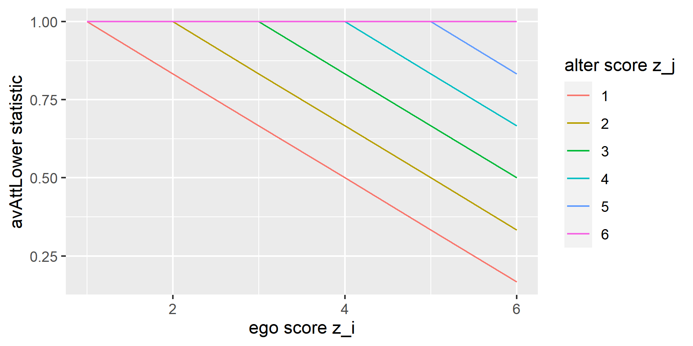

```{r, globalsettings, echo=FALSE, warning=FALSE}
library(knitr)
library(RSiena)
library(ggplot2)
knitr::opts_chunk$set(echo = TRUE)
opts_chunk$set(tidy.opts=list(width.cutoff=100),tidy=TRUE, warning = FALSE, message = FALSE,comment = "#>", cache=TRUE, class.source=c("test"), class.output=c("test2"))
options(width = 100)
rgl::setupKnitr()

colorize <- function(x, color) {sprintf("<span style='color: %s;'>%s</span>", color, x) }

```

```{r klippy, echo=FALSE, include=TRUE}
klippy::klippy(position = c('top', 'right'))
#klippy::klippy(color = 'darkred')
#klippy::klippy(tooltip_message = 'Click to copy', tooltip_success = 'Done')
```

<br>

---

## The average similarity effect

First, we include the *average similarity* (*avSim*) effect as an operationalization of peer influence. It is defined as: 
$$ s^{beh}_{i}(x,z) = x^{-1}_{i+}\sum_j x_{ij}(sim^z_{ij} - \widehat{sim^z}) $$
In the event of a micro-step with respect to the behavior, ego will choose the micro-step (+1/no change/-1) that results in the greatest average similarity score.
Thus, this effect measures the tendency of individuals to be similar with respect to the behavior to their alters.

This operationalization of peer influence assumes that ego is pulled up on the behavior scale by alters that score higher than themselves on the behavior,  $x^{-1}_{i+}\sum_j x_{ij} \, I \{ (z_j)>z_i \}$, and pulled down by alters that score lower than himself, $x^{-1}_{i+}\sum_j x_{ij} \, I \{ (z_j)<z_i \}$, to a similar extent.

<br>

## The average attraction towards higher alters effect

We expect that peer influence is exercised in particular by alters that score higher on the behavior than ego. We developed a new version of the avSim-effect that reflects this unilateral drive upward (i.e. upward assimilation). It is labeled the *average attraction towards higher* (*avAttHigher*) effect, and is defined as: 
$$ s^{beh}_{i}(x,z) = x^{-1}_{i+}\sum_j x_{ij} (\, I \{ (z_j)>z_i \} sim^z_{ij} + I \{ (z_j ) \le z_i \} )\,$$
If we assume a positive parameter estimate for this effect, than ego will - in the event of a micro-step with respect to the behavior - choose the micro-step that results in the greatest average similarity score, with similarity scores replaced by 1 for alters who do not score higher on the behavior than ego. 
Thus, this effect will draw actors whose alters score higher than themselves upward on the behavior scale, while diminishing their tendency to go downward to the same degree.

<br>

## The average attraction towards higher alters effect
Analogous to the avAttHigh-effect, is the *average attraction towards lower* (*avAttLower*) effect, where in the calculation of the average similarity score, similarity is replaced by 1 for alters who score higher on the behavior than ego:
$$ s^{beh}_{i}(x,z) = x^{-1}_{i+}\sum_j x_{ij} (\, I \{ (z_j)<z_i \} sim^z_{ij} + I \{ (z_j ) \ge z_i \} )\,$$
In the case of a positive parameter estimate, ego will assimilate downward to the behavior of his lower-behavior alters. His tendency to go upward is diminished by the same extent.

In the case of similar parameter estimates for avAttHigher and avAttLower, actors are influenced to the same degree by other actors with higher and lower values than themselves respectively. The combination of avAttHigher and avAttLower would in that case be identical to the avSim effect. 

----

<br> 

# Plots {.tabset .tabset-fade}

We illustrate this below.

First, we define some functions:

```{r class.source = 'fold-hide'}
fcentering <- function(actors){
centered <- actors - mean(actors)
return(centered)
}

fsimij <- function(actors){
#rv <- max(actors) - min(actors)
rv <- 6
mat1 <- matrix(actors, nrow=length(actors), ncol=length(actors), byrow=TRUE)
mat2 <- t(mat1)
simij <- 1 - ( abs(mat1-mat2) / rv)
return(simij)
}

favSim <- function(ego, alters) {
  actors <- c(ego,alters)
  beh_centered <- fcentering(actors)
  simij <- fsimij(beh_centered)
  diag(simij) <- NA
  msimij <- mean(simij, na.rm=TRUE) #only calculate mean on non-diagonal cells??!!
  simij_c <- simij - msimij
  
  statistic <- sum(simij_c[1,], na.rm = TRUE) / length(alters)
  
 
  return(statistic)
}


favSimH <- function(ego, alters) {
  actors <- c(ego,alters)
  beh_centered <- fcentering(actors)
  simij <- fsimij(beh_centered)
  diag(simij) <- NA
  #msimij <- mean(simij, na.rm=TRUE) #only calculate mean on non-diagonal cells??!!
  #simij_c <- simij - msimij
  #diag(simij_c) <- NA 
 simijH <- simij[1,]
 simijH[simijH <= beh_centered[1]] <- 1
 statistic <- sum(simijH, na.rm = TRUE) / length(alters)
  
 
  return(statistic)
}

favSimL <- function(ego, alters) {
  actors <- c(ego,alters)
  beh_centered <- fcentering(actors)
  simij <- fsimij(beh_centered)
  diag(simij) <- NA
  #msimij <- mean(simij, na.rm=TRUE) #only calculate mean on non-diagonal cells??!!
  #simij_c <- simij - msimij
  #diag(simij_c) <- NA 
 simijL <- simij[1,]
 simijL[simijL >= beh_centered[1]] <- 1
 statistic <- sum(simijL, na.rm = TRUE) / length(alters)
  
 
  return(statistic)
}
```

<br>

We calculate the statistics of the influence effects (avSim, avAttHigher, avAttLower, avAttHigher+Lower), considering both ego's behavior $z_i$ and alters' behavior $z_j$. We assume that ego's alters all have the same behavior. 

```{r class.source = 'fold-hide', eval=F}
rv <- 6
size <- 6

# alter behavior 1:6
alters <- list()
for (zj in 1:rv) {
  alters[[zj]] <- rep(zj, size)
}

# we caclulate avSim statistic, considering z_i and z_j:
(s_avSim <- array(dim = c(rv,rv)))
for (zj in 1:rv) {
  for (zi in 1:rv) {
    s_avSim[zi,zj] <- favSim(zi, alters[[zj]])
  }
} # rows refer to ego's prospective behavior (zi); columns refer to alter average (zj)

# turn it into a dataframe
df <- data.frame(zi = rep(1:rv, rv),
                   s = c(s_avSim[,1], s_avSim[,2], s_avSim[,3], s_avSim[,4], s_avSim[,5], s_avSim[,6] ),
                   zj = as.character(rep(1:rv, each=rv)))

# we do the same for the avAttHigh statistic
(s_avSimH <- array(dim = c(rv,rv)))
for (zj in 1:rv) {
  for (zi in 1:rv) {
    s_avSimH[zi,zj] <- favSimH(zi, alters[[zj]])
  }
} 
df2 <- data.frame(zi = rep(1:rv, rv),
                   s = c(s_avSimH[,1], s_avSimH[,2], s_avSimH[,3], s_avSimH[,4], s_avSimH[,5], s_avSimH[,6] ),
                   zj = as.character(rep(1:rv, each=rv)))

# for avAttLow
(s_avSimL <- array(dim = c(rv,rv)))
for (zj in 1:rv) {
  for (zi in 1:rv) {
    s_avSimL[zi,zj] <- favSimL(zi, alters[[zj]])
  }
} 
df3 <- data.frame(zi = rep(1:rv, rv),
                   s = c(s_avSimL[,1], s_avSimL[,2], s_avSimL[,3], s_avSimL[,4], s_avSimL[,5], s_avSimL[,6] ),
                   zj = as.character(rep(1:rv, each=rv)))

# and for avAttHigh+Low
(s_avSimHL <- array(dim = c(rv,rv)))
for (zj in 1:rv) {
  for (zi in 1:rv) {
    s_avSimHL[zi,zj] <- favSimH(zi, alters[[zj]]) + favSimL(zi, alters[[zj]])
  }
} 
df4 <- data.frame(zi = rep(1:rv, rv),
                   s = c(s_avSimHL[,1], s_avSimHL[,2], s_avSimHL[,3], s_avSimHL[,4], s_avSimHL[,5], s_avSimHL[,6] ),
                  zj = as.character(rep(1:rv, each=rv)))
 
ggplot(data=df, aes(x=zi, y=s)) + 
  geom_line(aes(colour=zj)) +
  ylab("avSim statistic") +
  xlab("ego score z_i") + 
  scale_colour_hue(name="alter score z_j")
ggsave("avSim.png", path = "images/influence plots", width = 6, height = 3)

ggplot(data=df2, aes(x=zi, y=s)) + 
  geom_line(aes(colour=zj)) +
  ylab("avAttHigher statistic") +
  xlab("ego score z_i") + 
  scale_colour_hue(name="alter score z_j")
ggsave("avSimH.png", path = "images/influence plots", width = 6, height = 3)

ggplot(data=df3, aes(x=zi, y=s)) + 
  geom_line(aes(colour=zj)) +
  ylab("avAttLower statistic") +
  xlab("ego score z_i") + 
  scale_colour_hue(name="alter score z_j")
ggsave("avSimL.png", path = "images/influence plots", width = 6, height = 3)

ggplot(data=df4, aes(x=zi, y=s)) + 
  geom_line(aes(colour=zj)) +
  ylab("avAttHigher+Lower statistic") +
  xlab("ego score z_i") + 
  scale_colour_hue(name="alter score z_j")
ggsave("avSimHL.png", path = "images/influence plots", width = 6, height = 3)

```

## avSim


avSim draws ego to the behavior of alters.

## avAttHigher


avAttHigher is a one-sided version of avSim. It refers to the influence from alters that score higher than ego. Ego is pulled up by alters that score higher than himself. 

## avAttLower


avAttHigher is a one-sided version of avSim. It refers to the influence from alters that score lower than ego. Ego is pulled down by alters that score lower than himself. 


## avAttHigher+Lower


avAttHigher and avAttLower even each other out; and equal avSim (assuming identical parameter values).

# {-}

