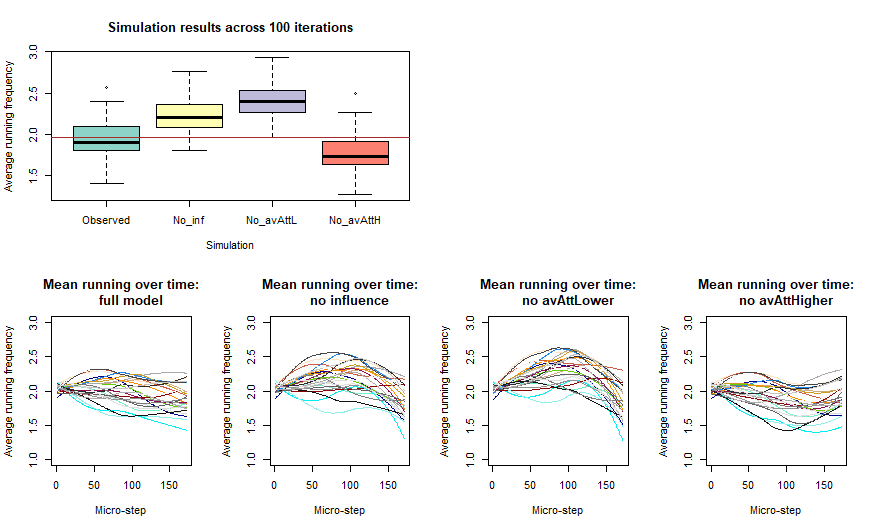
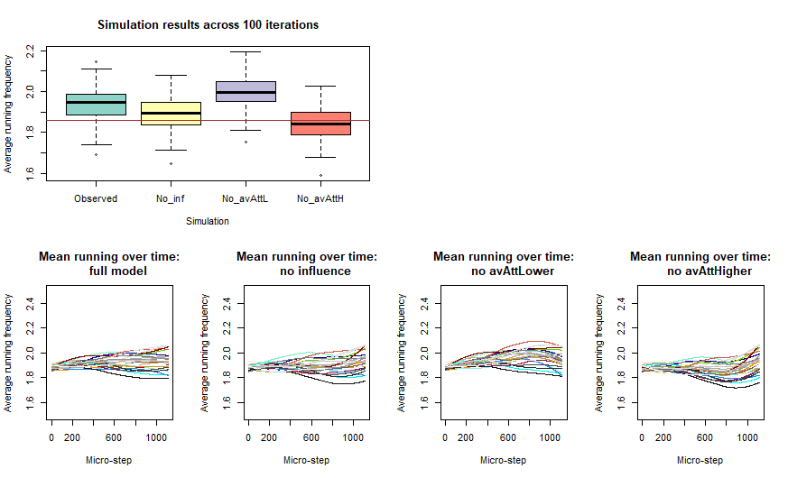
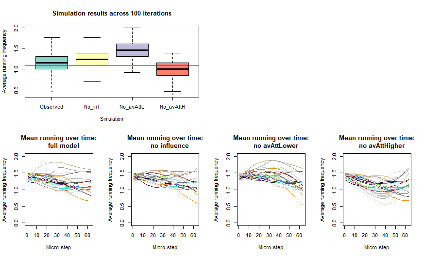

  
```{r, globalsettings, echo=FALSE, warning=FALSE, results='hide'}
library(knitr)
library(RSiena)
library(ggplot2)
knitr::opts_chunk$set(echo = TRUE)
opts_chunk$set(tidy.opts=list(width.cutoff=100),tidy=TRUE, warning = FALSE, message = FALSE,comment = "#>", cache=TRUE, class.source=c("test"), class.output=c("test2"))
options(width = 100)
rgl::setupKnitr()

colorize <- function(x, color) {sprintf("<span style='color: %s;'>%s</span>", color, x) }

```

```{r klippy, echo=FALSE, include=TRUE}
klippy::klippy(position = c('top', 'right'))
#klippy::klippy(color = 'darkred')
#klippy::klippy(tooltip_message = 'Click to copy', tooltip_success = 'Done')
```


---
  
Aim: to explore how consequential influence effects are for the running behavior (here, frequency) across clubs.

I reduced the data to only two time-points. Initial effect values are set based on the estimated model parameters of tables 2 and 3 of the manuscript.

I specify additional models: 1) with no peer influence effects whatsoever; 2) with only upward assimilation (avAttHigher); 3) with only downward assimilation (avAttLower).

100 simulations were run.

----

<br>


# Preparation

Clean the working environment. Required packages:

```{r, attr.output='style="max-height: 200px;"'}
# clean the working environment 
rm (list = ls( ))

# packages:
library(RSiena)
library(sna)
library(lattice)  # for plotting
library(RColorBrewer) # color palettes
```

<br> 

Load the club list, to set up our starting networks
```{r eval=T}
load("clubdata.RData")
```

<br>

The following scripts makes plots for all 5 clubs: 

- boxplots illustrating how average running behavior values differ across different simulation models.
- the development of the average running behavior for all sequences of micro-steps simulated (with both behavior and network change opportunities included)


```{r, eval=F}
plotL <- list() # list to store plots in

for (c in 1:length(clubdata)) {
 
  # pick club
  club <- clubdata[[c]]
  
  # we reduce the data to only two time points
  kudonet <- sienaDependent(club$kudo[,,1:2], allowOnly = FALSE)
  freq_run <- sienaDependent(club$freq_run[,,1:2], type = "behavior", allowOnly = FALSE) 
  
  # covariates
  # changing covariates not possible with only 2 waves, so we make other activity a constant
  freq_other <- coCovar(club$freq_other[, ,1])
  gender <- coCovar(ifelse(club$male == 1, 1, 2))
  
  # create a RSiena data object
  mydata <- sienaDataCreate(kudonet, freq_run, freq_other, gender)
  
  # load in the sienaFit object list, containing estimated parameters
  load(paste0("test/sienaFit/sienaFit_club", c, ".RData"))
  ans <- sienaFit[[5]] # get object for main model (m5)

  # make effects object
  myeff <- getEffects(mydata)
  # set initial values of basic effects for simulations based on estimated model
  myeff$initialValue[myeff$include==T] <- ans$theta[c(1,12,13,25,36,37)]
  
  # include extra effects and set initial value
  myeff <- setEffect(myeff, gwespFF, name = "kudonet", initialValue = ans$theta[which(ans$effects$shortName=="gwespFF")])
  myeff <- setEffect(myeff, outActSqrt, name = "kudonet", initialValue = ans$theta[which(ans$effects$shortName=="outActSqrt")])
  myeff <- setEffect(myeff, inPopSqrt, name = "kudonet", initialValue = ans$theta[which(ans$effects$shortName=="inPopSqrt")])
  myeff <- setEffect(myeff, outPopSqrt, name = "kudonet", initialValue = ans$theta[which(ans$effects$shortName=="outPopSqrt")])
  myeff <- setEffect(myeff, reciAct, name = "kudonet", initialValue = ans$theta[which(ans$effects$shortName=="reciAct")])
  myeff <- setEffect(myeff, outIso, name = "kudonet", initialValue = ans$theta[which(ans$effects$shortName=="outIso")])
  myeff <- includeInteraction(myeff, recip, gwespFF, parameter = 69, name = "kudonet")
  (eff1 <- myeff[myeff$include, ]$effect1[10])
  (eff2 <- myeff[myeff$include, ]$effect2[10])
  myeff <- setEffect(myeff, unspInt, effect1 = eff1, effect2 = eff2, initialValue = ans$theta[which(ans$effects$shortName=="unspInt")])
  myeff <- setEffect(myeff, higher, name = "kudonet", interaction1 = "freq_run", initialValue = ans$theta[which(ans$effects$shortName=="higher")])
  myeff <- setEffect(myeff, egoX, name = "kudonet", interaction1 = "gender", initialValue = ans$theta[which(ans$effects$shortName=="egoX")])
  myeff <- setEffect(myeff, altX, name = "kudonet", interaction1 = "gender", initialValue = ans$theta[which(ans$effects$shortName=="altX")])
  myeff <- setEffect(myeff, sameX, name = "kudonet", interaction1 = "gender", initialValue = ans$theta[which(ans$effects$shortName=="sameX")])
  myeff <- setEffect(myeff, effFrom, name = "freq_run", interaction1 = "freq_other", initialValue = ans$theta[which(ans$effects$shortName=="effFrom" & ans$effects$interaction1=="freq_other")])
  myeff <- setEffect(myeff, effFrom, name = "freq_run", interaction1 = "gender", initialValue = ans$theta[which(ans$effects$shortName=="effFrom" & ans$effects$interaction1=="gender")])
  myeff <- setEffect(myeff, indeg, name = "freq_run", interaction1 = "kudonet", initialValue = ans$theta[which(ans$effects$shortName=="indeg")])
  myeff <- setEffect(myeff, avAttHigher, name = "freq_run", interaction1 = "kudonet", initialValue = ans$theta[which(ans$effects$shortName=="avAttHigher")])
  myeff <- setEffect(myeff, avAttLower, name = "freq_run", interaction1 = "kudonet", initialValue = ans$theta[which(ans$effects$shortName=="avAttLower")])
  # fix effects at this value
  myeff$fix[myeff$include==T] <- TRUE 
  
  # I also specify models with no social influence, 
  myeff_noinf <- setEffect(myeff, avAttHigher, name = "freq_run", interaction1 = "kudonet", initialValue = 0, fix = TRUE)
  myeff_noinf <- setEffect(myeff_noinf, avAttLower, name = "freq_run", interaction1 = "kudonet", initialValue = 0, fix = TRUE)
  # only upward assimilation,
  myeff_nolow <- setEffect(myeff, avAttLower, name = "freq_run", interaction1 = "kudonet", initialValue = 0, fix = TRUE)
  # and only downward assimilation
  myeff_nohigh <- setEffect(myeff, avAttHigher, name = "freq_run", interaction1 = "kudonet", initialValue = 0, fix = TRUE)
  
  # set up the simulation settings
  nIter <- 100 # number of iterations
  sim_model <- sienaAlgorithmCreate(
    projname = 'sim_test1',
    cond = FALSE,
    useStdInits = FALSE, nsub = 0,
    n3 = nIter, 
    seed=242452, # seed for replication
    simOnly = TRUE)
  
  # I will extract the mean running frequency values from the simulation runs
  # make vectors to store means
  meanSimO <- rep(0, nIter)
  meanSim_noinf <- rep(0, nIter)
  meanSim_nolow <- rep(0, nIter)
  meanSim_nohigh <- rep(0, nIter)
  
  # simulation using estimated parameters
  sim_ans <- siena07(sim_model,          # simulation settings
                     data = mydata,      # data
                     effects = myeff,    # defined effects and set parameters
                     returnDeps = TRUE,  # return simulated networks and behaviors
                     returnChains = TRUE,# return sequences of micro-steps
                     batch = TRUE)
  sim_ans_noinf <- siena07(sim_model,         
                           data = mydata,     
                           effects = myeff_noinf,   
                           returnDeps = TRUE, 
                           returnChains = TRUE,
                           batch = TRUE)
  sim_ans_nolow <- siena07(sim_model,         
                           data = mydata,     
                           effects = myeff_nolow,   
                           returnDeps = TRUE, 
                           returnChains = TRUE,
                           batch = TRUE)
  sim_ans_nohigh <- siena07(sim_model,         
                            data = mydata,     
                            effects = myeff_nohigh,   
                            returnDeps = TRUE, 
                            returnChains = TRUE,
                            batch = TRUE)
  
  # extract mean behavior values from simulation runs
  for (i in 1:nIter) {
    meanSimO[i] <- mean(sim_ans$sims[[i]][[1]]$freq_run[[1]])
    meanSim_noinf[i] <- mean(sim_ans_noinf$sims[[i]][[1]]$freq_run[[1]])
    meanSim_nolow[i] <- mean(sim_ans_nolow$sims[[i]][[1]]$freq_run[[1]])
    meanSim_nohigh[i] <- mean(sim_ans_nohigh$sims[[i]][[1]]$freq_run[[1]])
  }
  #str(sim_ans$sims[[1]]) # numbering is as follows: nIter, group number, DV, period number
  
  # also store observed mean freq_run at t2
  meanObs <- mean(club$freq_run[,,2])
  
  #  make a layout for the plots
  dev.off()
  l <- layout(matrix(c(1, 1, 6, 6,  # First
                       2, 3, 4, 5), # and third plot
                     nrow = 2,
                     ncol = 4,
                     byrow = TRUE))
  #layout.show(l)
  
  # make data for plotting
  plot_data <- rbind(
    data.frame(cond="Observed", mean = meanSimO),
    data.frame(cond="No_inf", mean = meanSim_noinf),
    data.frame(cond="No_avAttL", mean = meanSim_nolow),
    data.frame(cond="No_avAttH", mean = meanSim_nohigh)
  )
  
  # reorder conditions
  plot_data$cond <- factor(plot_data$cond, levels=c("Observed", "No_inf", "No_avAttL", "No_avAttH"))
  color <- brewer.pal(4, "Set3") # get colors for boxplots
  boxplot(mean ~ cond, data = plot_data, main = paste("Simulation results across", nIter, "iterations"),
          xlab = "Simulation", ylab = "Average running frequency", col = color)
  abline(h=meanObs, col = "brown") # add the observed mean running at t2
  
  # I examine the running frequency changes in greater detail
  n_actors <- club$netsize
  
  Zs5 <- array(NA, dim=c(n_actors,1))
  Zb5 <- array (0, dim=c(nIter,1))
  for (i in 1: nIter) {
    for (j in 1:n_actors) {
      # simulated behavior of actor j in iteration i
      Zs5[j,1] <- sim_ans$sims[[i]][[1]]$freq_run[[1]][[j]] 
    }
    # mean simulated behavior over actors in iteration i
    Zb5[i] <-colSums(Zs5, na.rm=T)/n_actors
  }
  
  #colMeans(cbind(club$freq_run[,,1:2])) # observed means at t1 and t2
  #colMeans(Zb5)  # average mean simulated behavior value
  #mean( sim_ans$sims[[nIter]][[1]]$freq_run[[1]] )# mean of last simulation run
  
  
  # I plot the mean simulated running frequency over time 
  # extract mean drinking for all chains, with network change opportunities included
  simChanges <- rep(0, nIter)
  for (i in 1: nIter) {simChanges[i] <- length(sim_ans$chain[[i]][[1]][[1]]) }
  maxChanges <- max(simChanges)
  
  seqs <- matrix(Zb5, nr= nIter, nc=maxChanges+1)  # fill matrix with final mean
  seqs[,1] <- mean(club$freq_run[,,1])   # set t1 mean to observed level
  for (i in 1: nIter) {
    datChain <- t(matrix(unlist(sim_ans$chain[[i]][[1]][[1]]), nc=length(sim_ans$chain[[i]][[1]][[1]]))) 
    for (j in 1: simChanges[i]) {
      if (datChain[j,2]=="0") { 
        seqs[i,j+1] <- seqs[i,j]
      }
      if (datChain[j,2]=="1") { 
        seqs[i,j+1] <- seqs[i,j] + (as.numeric(datChain[j,6])/n_actors)
      }
    }
  }
  # plot multiple iterations using loess curves
  micros <- 1:dim(seqs)[2]
  lo1 <- loess(seqs[1,] ~ micros)
  l1 <- predict(lo1, micros)
  
  # set ylim; so it is consistent across plots
  ymin <- plyr::round_any(min(seqs), .5, f=floor)
  ymax <- plyr::round_any(max(seqs), .5, f=ceiling)
  
  plot(x=1:dim(seqs)[2], y=seqs[1,], ylim=c(ymin,ymax),type="l", 
       ylab='Average running frequency', xlab='Micro-step', col='white',
       main='Mean running over time:
     full model')	
  for (i in 1:25) {
    lines(x=micros, y=predict(loess(seqs[i,] ~ micros), micros), col=colors()[i*10])
  }
  
  # do the same for the model with no peer influence whatsoever. 
  for (i in 1: nIter) {
    for (j in 1:n_actors) {
      # simulated behavior of actor j in iteration i
      Zs5[j,1] <- sim_ans_noinf$sims[[i]][[1]]$freq_run[[1]][[j]] 
    }
    # mean simulated behavior over actors in iteration i
    Zb5[i] <-colSums(Zs5, na.rm=T)/n_actors
  }
  for (i in 1: nIter) {
    datChain <- t(matrix(unlist(sim_ans_noinf$chain[[i]][[1]][[1]]), nc=length(sim_ans_noinf$chain[[i]][[1]][[1]]))) 
    for (j in 1: simChanges[i]) {
      if (datChain[j,2]=="0") { 
        seqs[i,j+1] <- seqs[i,j]
      }
      if (datChain[j,2]=="1") { 
        seqs[i,j+1] <- seqs[i,j] + (as.numeric(datChain[j,6])/n_actors)
      }
    }
  }
  micros <- 1:dim(seqs)[2]
  lo1 <- loess(seqs[1,] ~ micros)
  l1 <- predict(lo1, micros)
  
  plot(x=1:dim(seqs)[2], y=seqs[1,], ylim=c(ymin,ymax),type="l", 
       ylab='Average running frequency', xlab='Micro-step', col='white',
       main='Mean running over time:
     no influence')	
  for (i in 1:25) {
    lines(x=micros, y=predict(loess(seqs[i,] ~ micros), micros), col=colors()[i*10])
  }
  
  # no downward assimilation. 
  for (i in 1: nIter) {
    for (j in 1:n_actors) {
      # simulated behavior of actor j in iteration i
      Zs5[j,1] <- sim_ans_nolow$sims[[i]][[1]]$freq_run[[1]][[j]] 
    }
    # mean simulated behavior over actors in iteration i
    Zb5[i] <-colSums(Zs5, na.rm=T)/n_actors
  }
  
  for (i in 1: nIter) {
    datChain <- t(matrix(unlist(sim_ans_nolow$chain[[i]][[1]][[1]]), nc=length(sim_ans_nolow$chain[[i]][[1]][[1]]))) 
    for (j in 1: simChanges[i]) {
      if (datChain[j,2]=="0") { 
        seqs[i,j+1] <- seqs[i,j]
      }
      if (datChain[j,2]=="1") { 
        seqs[i,j+1] <- seqs[i,j] + (as.numeric(datChain[j,6])/n_actors)
      }
    }
  }
  micros <- 1:dim(seqs)[2]
  lo1 <- loess(seqs[1,] ~ micros)
  l1 <- predict(lo1, micros)
  
  plot(x=1:dim(seqs)[2], y=seqs[1,], ylim=c(ymin,ymax),type="l", 
       ylab='Average running frequency', xlab='Micro-step', col='white',
       main='Mean running over time:
     no avAttLower')	
  for (i in 1:25) {
    lines(x=micros, y=predict(loess(seqs[i,] ~ micros), micros), col=colors()[i*10])
  }
  
  # no upward assimilation. 
  for (i in 1: nIter) {
    for (j in 1:n_actors) {
      # simulated behavior of actor j in iteration i
      Zs5[j,1] <- sim_ans_nohigh$sims[[i]][[1]]$freq_run[[1]][[j]] 
    }
    # mean simulated behavior over actors in iteration i
    Zb5[i] <-colSums(Zs5, na.rm=T)/n_actors
  }
  
  for (i in 1: nIter) {
    datChain <- t(matrix(unlist(sim_ans_nohigh$chain[[i]][[1]][[1]]), nc=length(sim_ans_nohigh$chain[[i]][[1]][[1]]))) 
    for (j in 1: simChanges[i]) {
      if (datChain[j,2]=="0") { 
        seqs[i,j+1] <- seqs[i,j]
      }
      if (datChain[j,2]=="1") { 
        seqs[i,j+1] <- seqs[i,j] + (as.numeric(datChain[j,6])/n_actors)
      }
    }
  }
  micros <- 1:dim(seqs)[2]
  lo1 <- loess(seqs[1,] ~ micros)
  l1 <- predict(lo1, micros)
  
  plot(x=1:dim(seqs)[2], y=seqs[1,], ylim=c(ymin,ymax),type="l", 
       ylab='Average running frequency', xlab='Micro-step', col='white',
       main='Mean running over time:
     no avAttHigher')	
  for (i in 1:25) {
    lines(x=micros, y=predict(loess(seqs[i,] ~ micros), micros), col=colors()[i*10])
  }
  
  #save the plot to the list
  plotL[[c]] <- recordPlot()

}

```


# Plots {.tabset .tabset-fade}

## club 1
```{r,include=TRUE, fig.align="center", echo=FALSE}

```

## club 2
```{r,include=TRUE, fig.align="center", echo=FALSE}
knitr::include_graphics("test/simulations/plots_club2.png")
```

## club 3
```{r,include=TRUE, fig.align="center", echo=FALSE}

```

## club 4
```{r,include=TRUE, fig.align="center", echo=FALSE}

```

## club 5
```{r,include=TRUE, fig.align="center", echo=FALSE}
knitr::include_graphics("test/simulations/plots_club5.png")
```

# {-}